<a href="https://github.com/gzaber/memorization_app/actions"></a>
<a href="https://codecov.io/gh/gzaber/memorization_app"></a>
<a href="https://opensource.org/licenses/MIT"></a>

# memorization_app

A mobile application designed to support learning vocabulary and definitions.  
Learning materials can be downloaded from the Google Sheets files published on the web as CSV files.

## Table of contents

- [Screenshots](#screenshots)
- [Features](#features)
- [Packages used](#packages-used)
- [Setup](#setup)
- [Test](#test)
- [Run](#run)

## Screenshots

[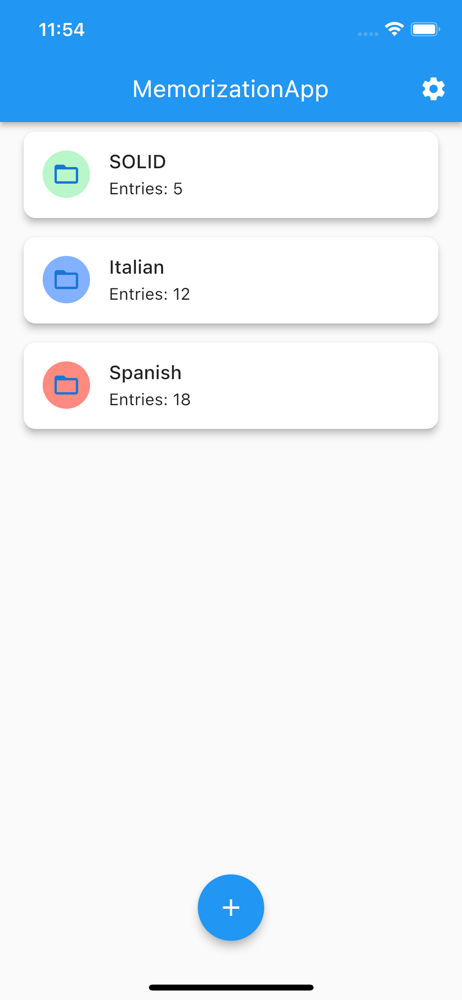](.screenshots/decks_overview.png)
[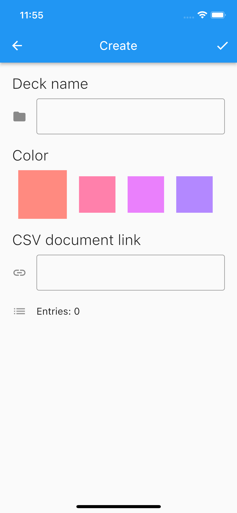](.screenshots/manage_deck_create.png)
[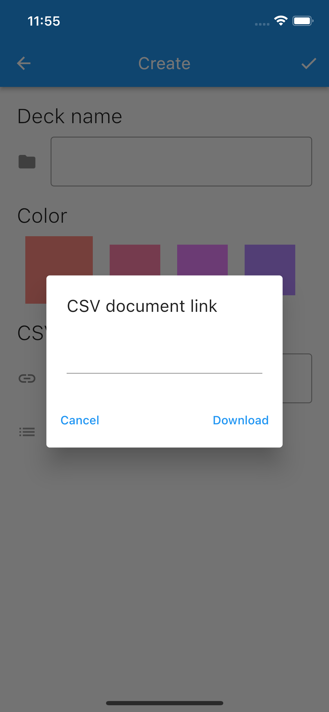](.screenshots/manage_deck_csv_link_dialog.png)
[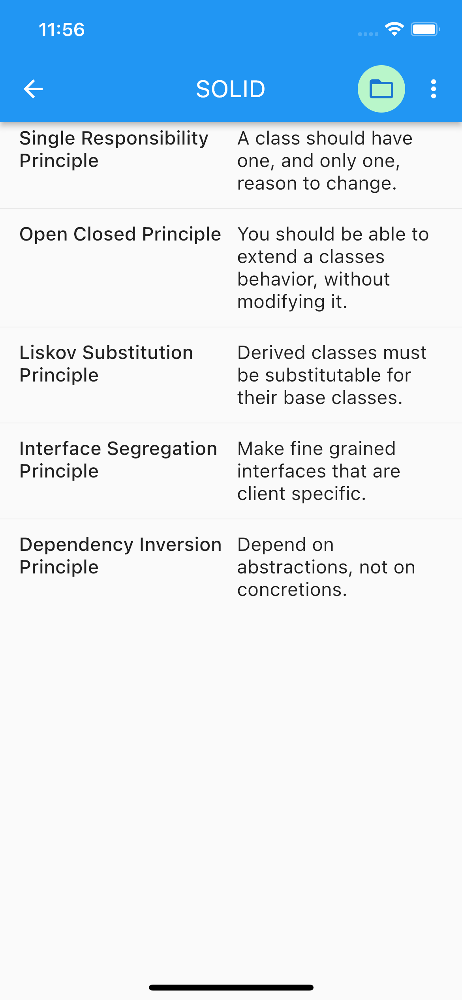](.screenshots/deck_horizontal_layout.png)
[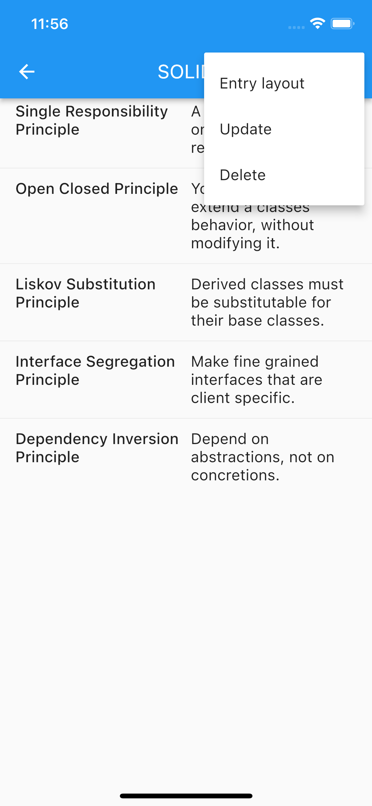](.screenshots/deck_menu.png)
[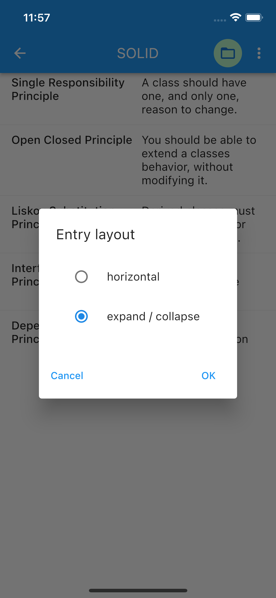](.screenshots/deck_entry_layout_dialog.png)
[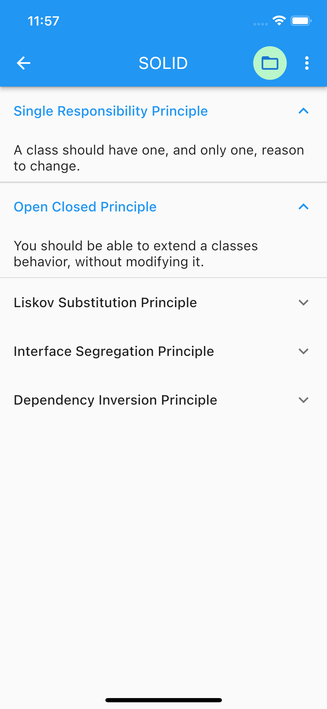](.screenshots/deck_expand_collapse_layout.png)
[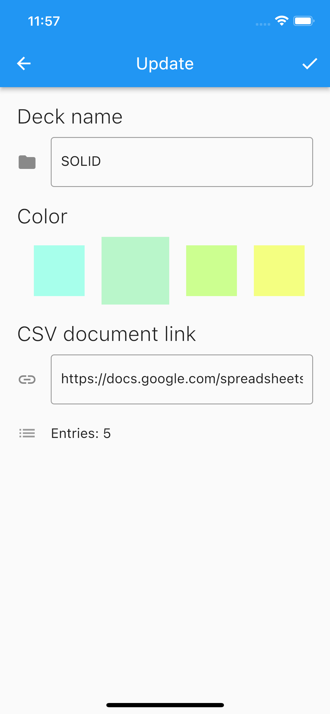](.screenshots/manage_deck_update.png)
[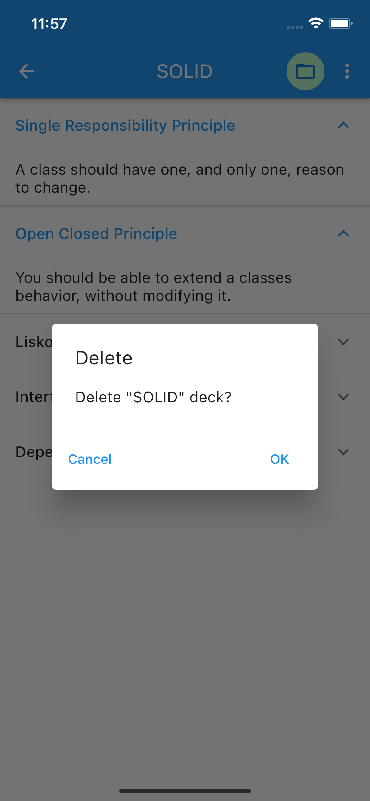](.screenshots/deck_delete.png)
[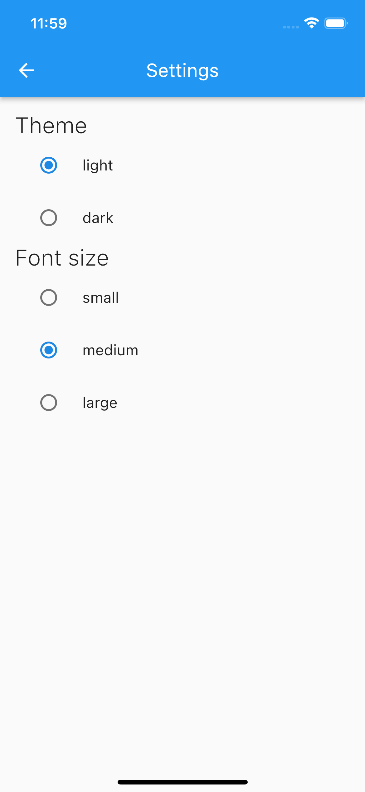](.screenshots/settings.png)
[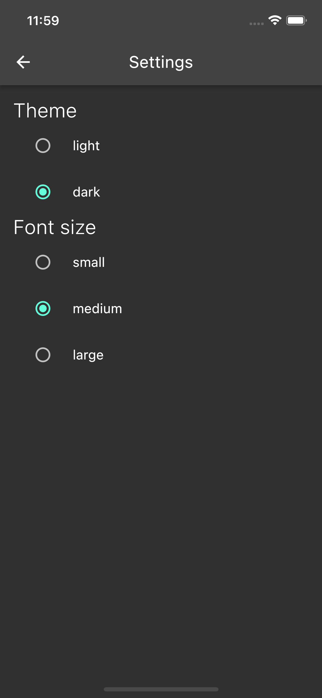](.screenshots/settings_dark.png)
[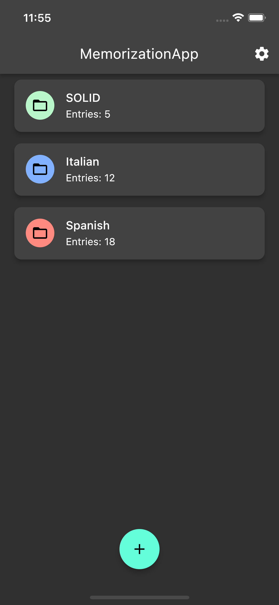](.screenshots/decks_overview_dark.png)

## Features

- create, update, delete deck
- download entries from GoogleSheets
- different layouts for entries
- light / dark theme
- different font sizes
- supported locales: en, pl

## Packages used

- equatable
- bloc
- csv
- hive
- http

## Setup

Clone or download this repository.  
Use the following command to install all the dependencies:

```
$ flutter pub get
```

## Test

Run the tests using your IDE or using the following command:

```
$ flutter test --coverage
```

For local packages run above command in package root directory.

## Run

Create Google Sheets file. Fill in the first two columns with data. Publish file on the web as a CSV file. Use generated link in the application.

[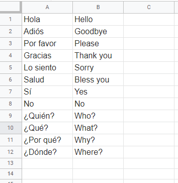](.screenshots/gs_data.png)

Run the application using your IDE or using the following command:

```
$ flutter run
```
