# memorization_app

A mobile application designed to support learning vocabulary and definitions.  
Learning materials are downloaded from the Google Sheets files.

## Table of contents

- [Features](#features)
- [Screenshots](#screenshots)
- [Technologies](#technologies)
- [Setup](#setup)
- [Launch](#launch)
- [Test](#test)

## Features

- Create, update, delete deck
- Different entry layouts
- Light / dark theme
- Different font sizes

## Screenshots

[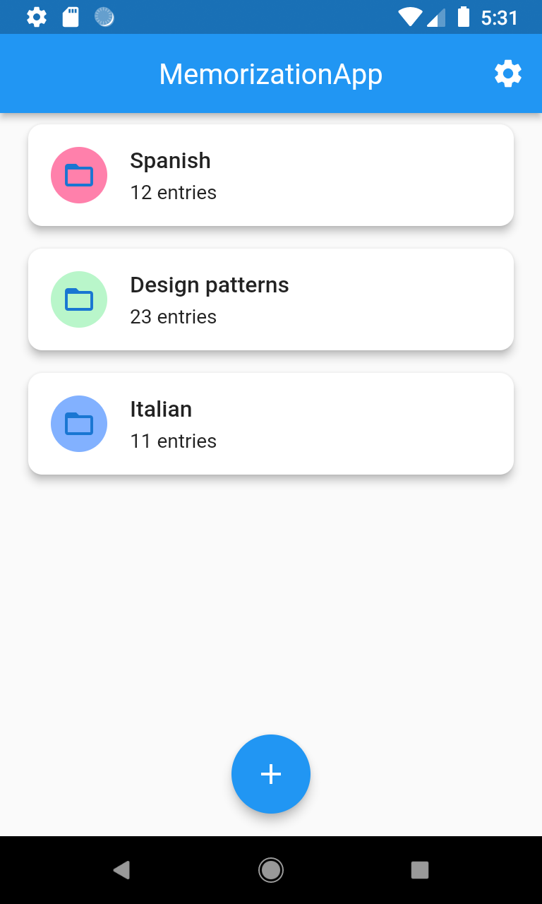](_screenshots/home_light.png)
[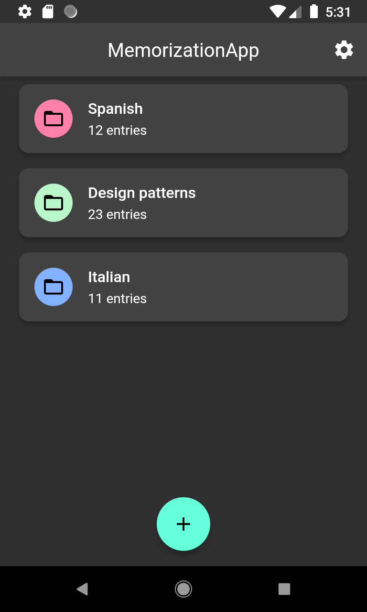](_screenshots/home_dark.png)
[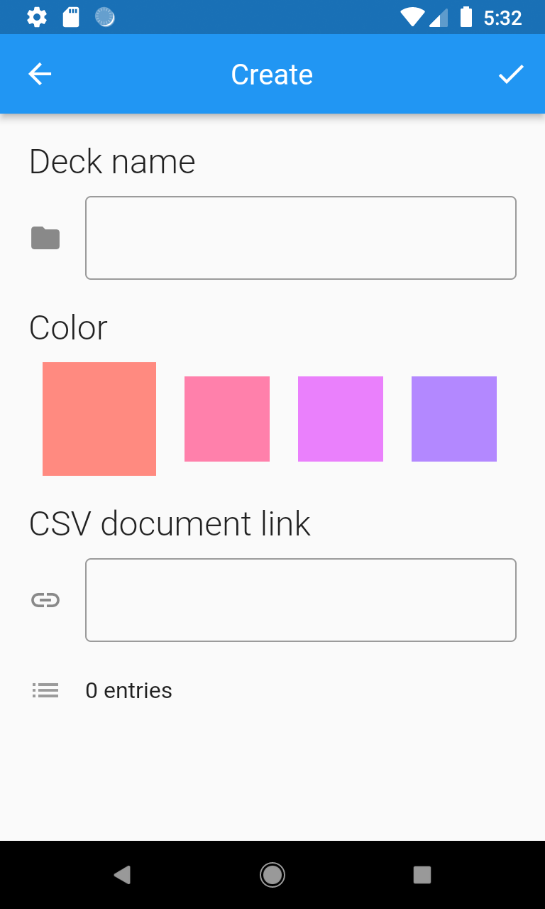](_screenshots/create_deck.png)
[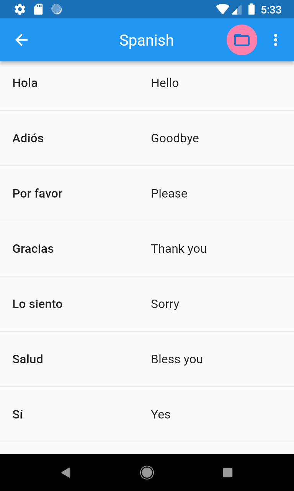](_screenshots/row_layout.png)
[](_screenshots/expansion_layout.png)
[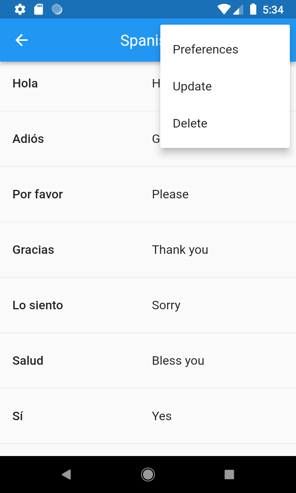](_screenshots/menu.png)
[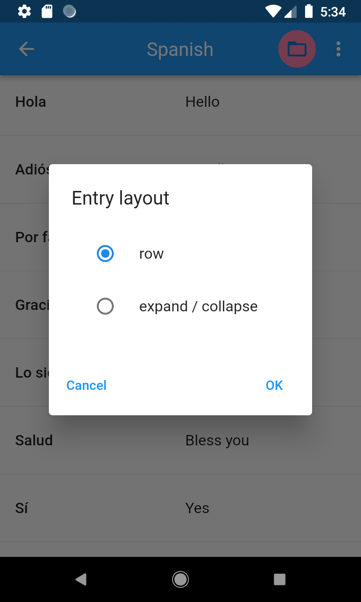](_screenshots/entry_layout_dialog.png)
[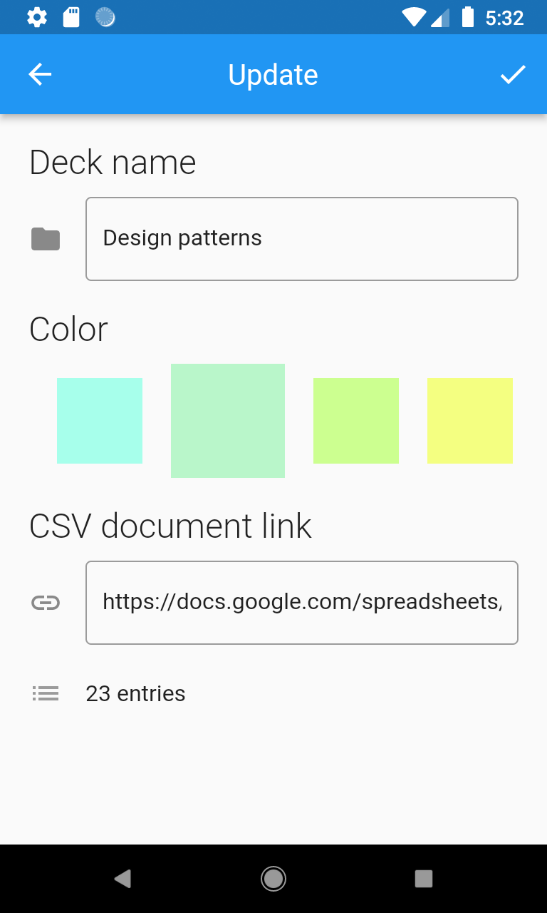](_screenshots/update_deck.png)
[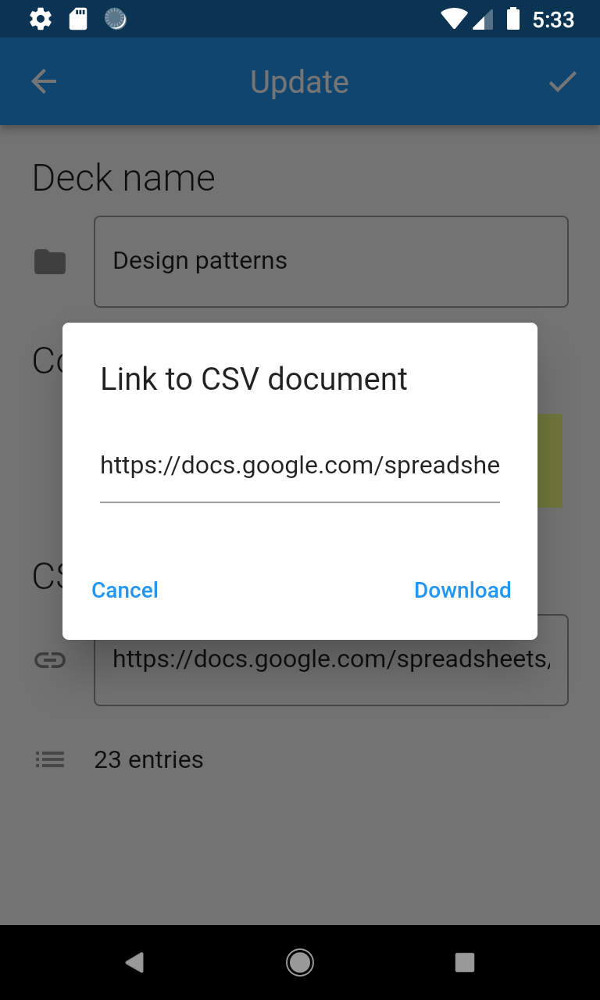](_screenshots/csv_link.png)
[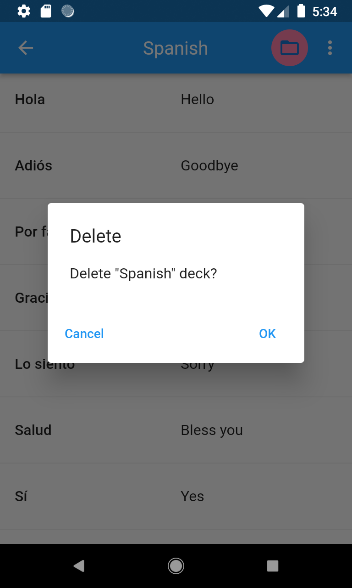](_screenshots/delete_deck.png)
[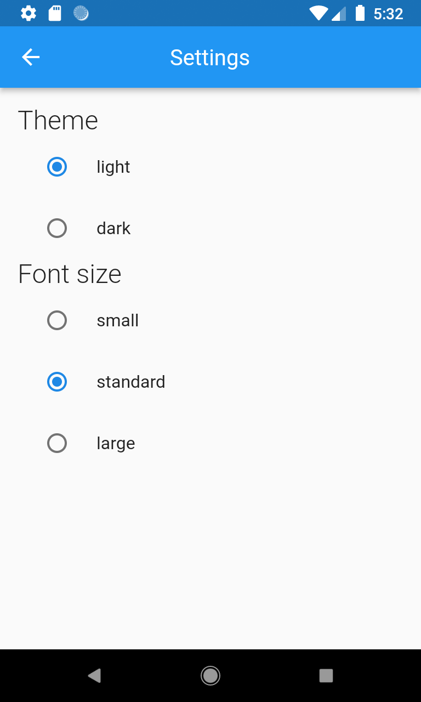](_screenshots/settings.png)

## Technologies

- Dart
- Flutter
- BLoC / Cubit
- Hive

## Setup

Clone or download this repository.  
Use the following command to install all the dependencies:

```
flutter pub get
```

Use the following command to update to the latest compatible versions of all the dependencies :

```
flutter pub upgrade
```

Use the following command to create platform-specific folders:

```
flutter create .
```

## Launch

Create Google Sheets file. Fill in the first two columns with data. Publish file on the web as a csv file. Use generated link in the application.

[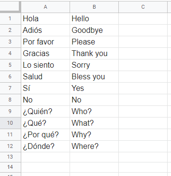](_screenshots/gs_data.png)

Run the application using your IDE or using the following command:

```
flutter run
```

## Test

Run the tests using your IDE or using the following command:

```
flutter test
```
